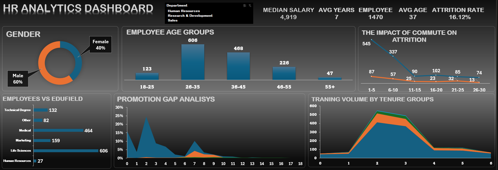

# 👥 HR Analytics Dashboard

## Power BI Project

## 📄 Overview
This project analyzes Human Resources data, focusing on employee demographics, attrition rates, and workforce trends. The dashboard provides key insights into employee backgrounds, age distributions, and training volumes to help HR teams optimize retention and employee development strategies.

## 🖼️ Dashboard Preview

## 🔑 Key Metrics
* **Total Employees:** 1,470
* **Attrition Rate:** 16.12%
* **Average Age:** 37
* **Average Years (Tenure):** 7
* **Median Salary:** 4,919

## 🚀 Main Insights

* **👥 Workforce Demographics:** The company has a gender distribution of **60% Male** and **40% Female**.
* **📅 Age Distribution:** The largest employee age group falls between **26-35 years** (606 employees), followed by the 36-45 group, indicating a relatively young and active core workforce.
* **🎓 Education Background:** The majority of employees have an educational background in **Life Sciences** (606 employees) and **Medical** fields (464 employees).
* **🚗 Commute & Attrition:** The dashboard highlights the relationship between commuting distances and attrition rates, helping identify if commute stress is a factor in employee turnover.
* **📈 Training & Tenure:** Training volume shows a significant peak for employees in their early tenure (around 2 to 3 years), reflecting heavy investment in onboarding and early-stage skill development.
*
